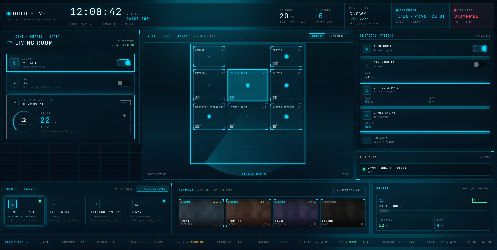
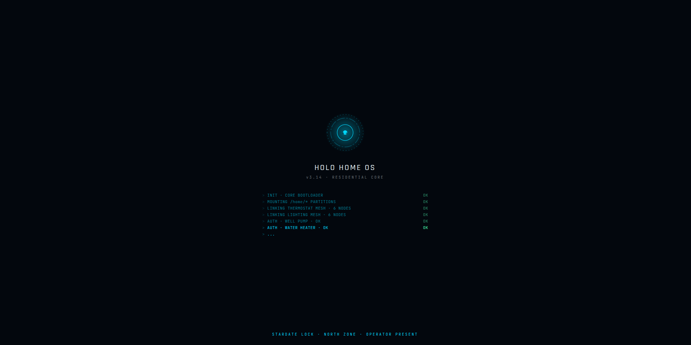
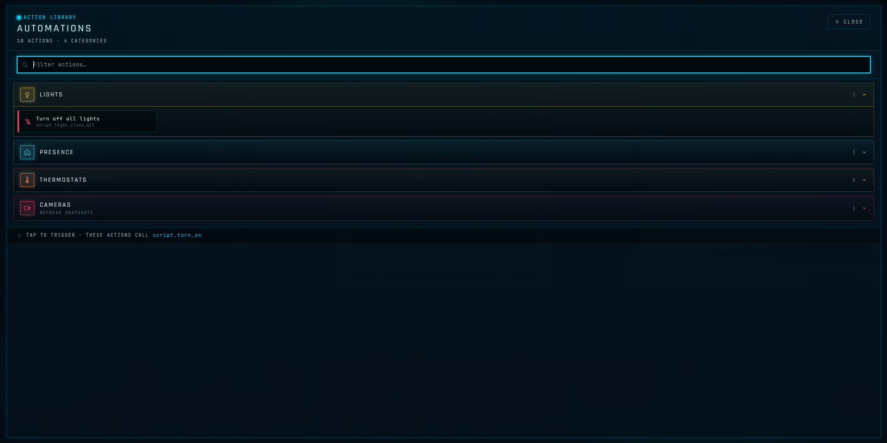
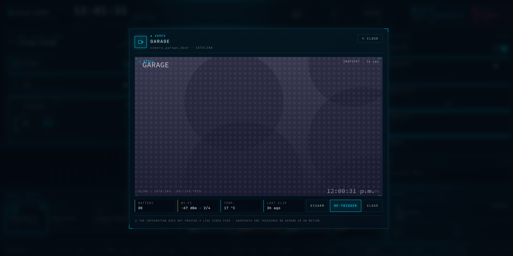
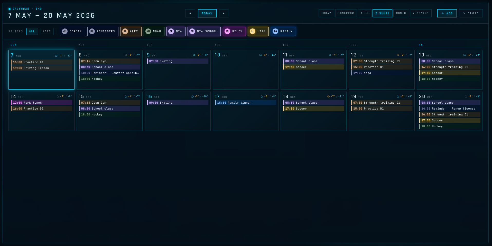
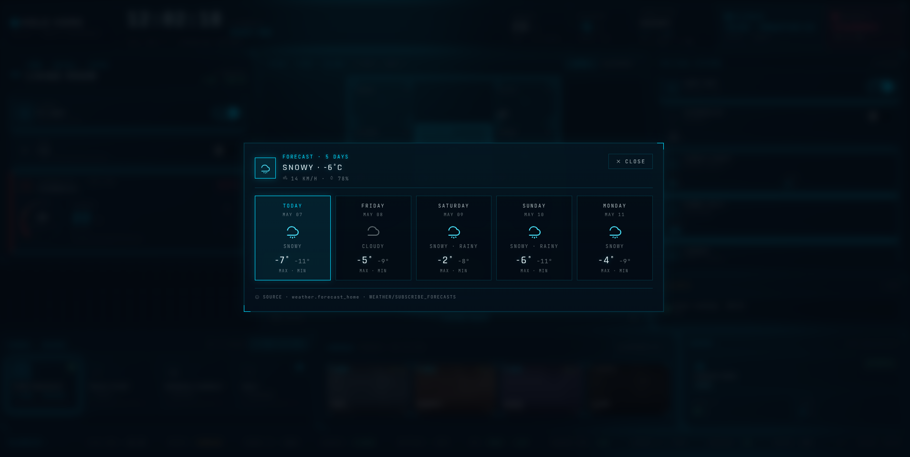

# Holo — Dashboard

A sci-fi smart-home control surface for **Home Assistant**, designed as a wall-mounted kiosk experience. Holo turns a static floorplan into a live, entity-driven cockpit with zones, scenes, cameras, weather, and calendar — wired directly to your HA WebSocket API.

  



---

## Screenshots

| | |
|---|---|
|  **Boot / loading** |  **Main dashboard** |
|  **Extra actions** |  **Camera feed** |
|  **Calendar screen** |  **Weather forecast** |

---

## Key Features

- **Live Home Assistant integration** — connects to `/api/websocket`, batches `state_changed` events per `requestAnimationFrame`, exposes `useEntity` / `useEntityActions` hooks.
- **Mock-or-real toggle** — flip `connection.useRealHA` to develop against an in-process HA WebSocket mock (`ha-mock.jsx`) that mimics `home-assistant-js-websocket`.
- **SVG floorplan** — two floors (`rdc`, `bas`), each zone placed by `geometry: {x,y,w,h}` and dispatching to a `kind`-discriminated entity panel.
- **Entity kinds** — `thermo`, `light`, `switch`, `fan`, `sensor`, `printer`, `appliance`, plus per-zone `cover` (garage doors, etc.).
- **Cameras & doors ticker** — on-demand snapshot refresh via `script.refresh_cameras_maison` (battery-friendly Blink workflow, no polling).
- **Scenes, extra actions, weather modal, calendar screen** — each one panel of a `gridTemplateAreas` shell.
- **Bilingual UI** (`en-CA` / `fr-CA`) — `window.t(key, vars)`, `formatDate`, `formatTime`, `weekdayNames`. Author per-language `config.json` for zone/scene labels.
- **Runtime theming** — palette / motion / grid density / viewport (`fluid`, `1280`, `1920`) overridable from the Tweaks panel via CSS custom properties on `:root`.
- **Token-prompt boot** — fullscreen sci-fi modal asks for HA long-lived token on first load, persists to `localStorage`. Kiosk fallback supported.
- **Kiosk deploy** — one-shot `deploy.sh` tar-pipes `project/` over SSH to a lighttpd target (DietPi/BusyBox-friendly).

---

## Tech Stack

| Layer        | Tool                                                                   |
|--------------|------------------------------------------------------------------------|
| UI           | React 18.3.1 + ReactDOM (UMD via unpkg)                                |
| Transpile    | `@babel/standalone` 7.29.0 — in-browser, no build step                 |
| Backend wire | Home Assistant WebSocket API (real) + custom in-process mock           |
| Styling      | Hand-written `styles.css`, CSS custom properties, Rajdhani / JetBrains Mono / Inter (Google Fonts) |
| Dev server   | `python3 -m http.server` → `busybox httpd` → `npx serve` (auto-pick)   |
| Deploy       | `tar | ssh` to lighttpd kiosk, SSH `ControlMaster` reuse               |

No bundler. No npm install. No tests.

---

## Quick Start

### Prerequisites

- A modern browser (Chrome/Firefox/Safari).
- One of: `python3`, `busybox`, or `npx` on your PATH.
- *(Optional, for real mode)* A Home Assistant instance + long-lived access token + this app's origin in HA's `http.cors_allowed_origins`.

### Install & Run

```bash
git clone <this-repo>
cd holo-dashboard/holo-home
./run_dev.sh                  # http://localhost:8000/
./run_dev.sh -p 8080 -o       # custom port + open browser
./run_dev.sh -h               # full flags
```

> `file://` will not work — `config-loader.jsx` does `fetch("./config.json")` and needs an HTTP origin.

### Basic Usage

Edit `project/config.json`, reload the page. That is the loop.

```jsonc
{
  "language": "en",
  "connection": {
    "useRealHA": false,                 // flip to true for live HA
    "url": "http://localhost:8123",
    "tokenStorageKey": "holohome.haToken"
  },
  "zones": [
    {
      "id": "kitchen",
      "name": "Kitchen",
      "floor": "rdc",
      "geometry": { "x": 4, "y": 18, "w": 22, "h": 22 },
      "entities": [
        { "kind": "light",  "id": "switch.smartswitchkitchen_left", "label": "Light" },
        { "kind": "thermo", "id": "climate.thermostatdiningroom",   "label": "Thermostat" }
      ]
    }
  ]
}
```

Going live: set `connection.useRealHA: true`, paste a long-lived token into the `<TokenPrompt/>` on first load (or pre-seed `connection.haLongLivedToken` for a kiosk).

---

## Module Overview

Script load order is fixed in `index.html`. JSX files share state via `window.*` globals — no ES modules.

| File                          | Role                                                                                          |
|-------------------------------|-----------------------------------------------------------------------------------------------|
| `config-loader.jsx`           | `fetch()`s + validates `config.json`, exposes `window.APP_CONFIG`, `window.HOME_LAYOUT`, `__configReady`. |
| `i18n.jsx`                    | Sets `window.LANG`, exposes `t()`, `formatDate()`, `formatTime()`, `weekdayNames()`.          |
| `data.jsx`                    | No-op shim. All wiring now lives in `config.json`.                                            |
| `ha-mock.jsx`                 | In-process HA WS mock: `auth`, `get_states`, `subscribe_events`, `call_service`, drift loops. |
| `primitives.jsx`              | Destructures React hooks; exports `Icon`, `Tag`, `PulseDot`, `useStardate`, `playBeep`.       |
| `ha-client.jsx`               | `HAProvider`, `useHA`, `useEntity`, `useEntityActions`, `resolveSnapshot`, `<TokenPrompt/>`.  |
| `tweaks-panel.jsx`            | Floating dev panel + Claude Design editmode protocol bridge.                                  |
| `boot.jsx`                    | Boot animation.                                                                               |
| `topbar.jsx`                  | Stardate, weather glance, alerts.                                                             |
| `floorplan.jsx`               | SVG floorplan, zone hit-testing.                                                              |
| `zone-detail.jsx`             | Per-zone entity rail; switches on `kind`.                                                     |
| `systems-rail.jsx`            | System summary column.                                                                        |
| `cameras-doors-ticker.jsx`    | Camera grid + door states + scrolling ticker.                                                 |
| `extra-actions.jsx`           | Grouped one-shot actions.                                                                     |
| `scenes.jsx`                  | Scene tiles.                                                                                  |
| `footage-modal.jsx`           | Camera footage popout, refresh-on-open.                                                       |
| `weather-modal.jsx`           | Forecast modal.                                                                               |
| `calendar-screen.jsx`         | Multi-source calendar view.                                                                   |
| `app.jsx`                     | Root: `<HAProvider><Shell/></HAProvider>`, derives alerts + ticker, palette/viewport state.   |

### Hooks (from `ha-client.jsx`)

- `useHA()` → `{ conn, states, callService, resolveSnapshot }`
- `useEntity(entity_id)` → cached HA state object
- `useEntityActions(entity_id)` → `{ toggle, turnOn, turnOff, setTemperature, openCover, closeCover, toggleCover }`
- `resolveSnapshot(entity_id)` → SVG (mock) or `${HA_URL}${attributes.entity_picture}` (real)

### Validator grammar

`config-loader.jsx` enforces:
- `kind` enum: `thermo | light | switch | fan | sensor | printer | appliance`
- `entity_id`: `^[a-z_]+\.[a-z0-9_]+$`
- All `id` fields unique across the config

---

## Configuration

All wiring lives in **`project/config.json`**. There is no env-file dependency for the app itself.

| Key                              | Purpose                                                              |
|----------------------------------|----------------------------------------------------------------------|
| `language`                       | `"en"` or `"fr"` — drives `i18n.jsx`. Config labels not translated.  |
| `connection.useRealHA`           | `false` → mock, `true` → real HA WebSocket.                          |
| `connection.url`                 | HA base URL (e.g. `https://ha.example.net`).                         |
| `connection.tokenStorageKey`     | `localStorage` key for the user-entered token.                       |
| `connection.haLongLivedToken`    | *(Optional, kiosk only)* Fallback token if `localStorage` empty.     |
| `weatherEntity` / `outsideTempEntity` / `alarmEntity` | HA entity ids surfaced in the topbar.       |
| `refreshCamerasScript`           | HA script id called to re-snapshot all Blink cameras.                |
| `thermoColors`                   | Hex palette for heating/cooling/idle states.                         |
| `floors[]`                       | Floor ids + display labels. Two-floor layout (`rdc`, `bas`).         |
| `zones[]`                        | id, name, icon, floor, `geometry`, optional `cover`, `entities[]`.   |
| `zones[].entities[].kind`        | Discriminator that `zone-detail.jsx` switches on.                    |

> **Token security.** `localStorage` always wins over `haLongLivedToken`. Do **not** commit a token-bearing `config.json` to a public repository — keep it on the kiosk only. `deploy.sh` preserves the remote `config.json` across deploys for this reason; pass `-f` to force-overwrite.

> **CORS.** Add the dashboard's origin to HA's `http.cors_allowed_origins` and restart HA before going live.

---

## Deploy

```bash
./deploy.sh                 # defaults → -H/-P flags → host config
./deploy.sh -n              # dry run
./deploy.sh -k              # install SSH pubkey for passwordless deploy
./deploy.sh -f              # force overwrite remote config.json
```

Tar-piped-over-SSH; works on DietPi / BusyBox without remote rsync. SSH `ControlMaster` keeps prompts to one per run.

---

## Conventions

- **Entity ids are real** — they map directly to a Home Assistant instance. Do not invent or rename them.
- **No periodic camera polling** — Blink is battery-powered; refresh on-demand only.
- **Adding a component** — create `<thing>.jsx`, attach to `window`, add a `<script type="text/babel">` line to `index.html` in dependency order.
- **No build, no test, no lint.** Edits to `.jsx` / `.json` / `.css` take effect on reload.
